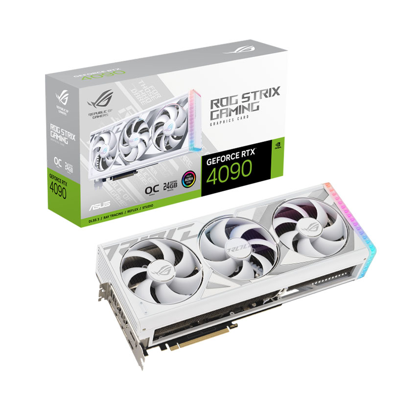

# Website Bán Linh Kiện máy tính ELECTRO
Một Website cơ bản bao gồm trang cửa hàng và trang quản trị


# Cách Dùng:
1. Tải XAMPP và cài qua link này: https://www.apachefriends.org/
2. Giải nén và đặt file zip đã tải ở trên vào thư mục htdocs của xampp bạn vừa tải
3. Chạy PhpMyadmin và tạo cơ sở dữ liệu tên pc
4. Lấy file sql trong folder database rồi import vào PhpMyAdmin
5. Đăng nhập bằng tài khoản admin là: trung1 và mật khẩu là 123


# Mọi người có thể fork repo này
Đây là bài đề án của tôi, ai cũng có thể fork hoặc sử dụng nó
```
Viết bo JackFrauer
```
